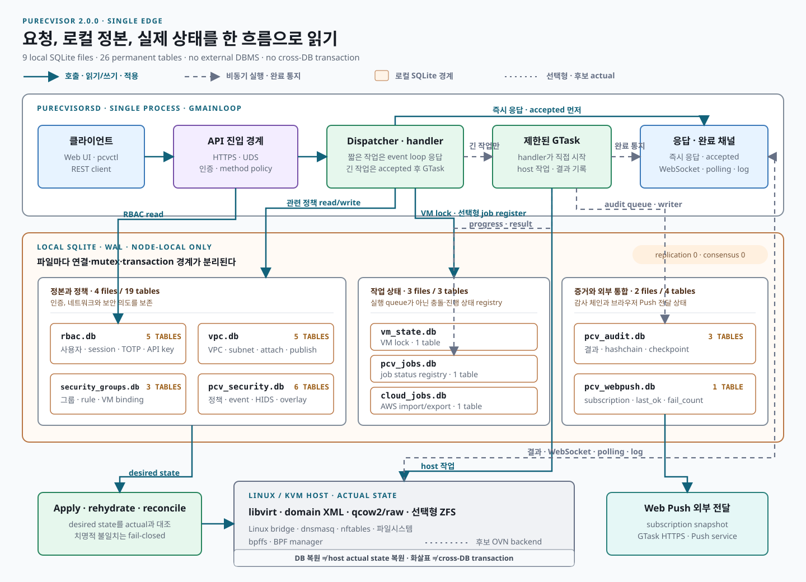

# PureCvisor Single Edge 데이터베이스 아키텍처 설명서

> **기준 시점:** 2026-08-31
>
> **대상:** `purecvisor-single`의 SQLite 기반 영속 상태
>
> **문서 지위:** DB 파일별 책임, 데이터 소유권, 일관성·장애·백업 경계를 설명하는 개발·운영 정본

이 문서는 소스코드에 분산된 SQLite 저장소를 하나의 아키텍처로 설명한다. 실제 DDL과
마이그레이션의 단일 진실은 각 모듈의 `CREATE TABLE`, `ALTER TABLE`, `PRAGMA` 코드다. 이
문서는 그 구현을 운영자, 아키텍트, 개발자가 같은 기준으로 해석하기 위한 해설서다.

이 문서의 범위는 SQLite에 한정된다. libvirt domain XML, ZFS dataset·snapshot, 네트워크
JSON·메타데이터, nftables·OVS·OVN, bpffs, systemd 상태처럼 DB 밖에 있는 실제 상태도
PureCvisor의 전체 상태를 구성한다. 따라서 “DB 복원”은 곧 “서비스 전체 상태 복원”을
뜻하지 않는다.

---

## 1. 아키텍처 개요

`purecvisor-single`은 외부 DBMS를 요구하지 않고 로컬 SQLite 파일 9개로 상태를 나눠
저장한다. 이 9개 파일에는 영구 테이블 26개가 있으며, 모두 한 Single Edge 노드 안에서만
사용한다. 노드 간 복제·합의·분산 트랜잭션은 제공하지 않는다. 각 모듈이 자기 DB의 연결과
스키마를 소유하고 대부분 WAL 모드로 연다.

<div class="pcv-database-summary pcv-technical-wide" role="list" aria-label="데이터베이스 아키텍처 핵심 수치">
  <div class="pcv-database-summary-item" role="listitem"><strong>9</strong><span>로컬 SQLite 파일</span></div>
  <div class="pcv-database-summary-item" role="listitem"><strong>26</strong><span>영구 테이블</span></div>
  <div class="pcv-database-summary-item" role="listitem"><strong>0</strong><span>외부 DBMS</span></div>
  <div class="pcv-database-summary-item" role="listitem"><strong>0</strong><span>DB 간 원자 트랜잭션</span></div>
</div>

### 1.1 요청에서 실제 상태까지

<figure class="pcv-database-architecture pcv-control-map pcv-architecture-source" aria-labelledby="pcv-database-architecture-title" aria-describedby="pcv-database-architecture-note">
  <div class="pcv-map-bar">
    <strong id="pcv-database-architecture-title">Single Edge · 로컬 데이터 흐름</strong>
    <div class="pcv-map-meta">
      <span class="pcv-status"><i aria-hidden="true"></i>9 DB · 26 TABLES</span>
      <a class="pcv-architecture-source-open" href="../site/public/assets/diagrams/purecvisor-single-database-architecture.svg" target="_blank" rel="noopener">SVG 원본 열기 <span aria-hidden="true">↗</span></a>
    </div>
  </div>
  <a class="pcv-architecture-source-canvas pcv-database-architecture-canvas" href="../site/public/assets/diagrams/purecvisor-single-database-architecture.svg" target="_blank" rel="noopener" aria-label="클라이언트 요청이 purecvisorsd 제어면으로 들어와 요청 종류에 따라 9개 로컬 SQLite 파일 중 관련 저장소를 읽거나 갱신하고 Linux KVM 실제 상태 및 응답 완료 채널과 연결되는 데이터베이스 아키텍처 SVG를 새 탭에서 확대해서 보기">
    
  </a>
  <figcaption id="pcv-database-architecture-note" class="pcv-architecture-source-note">실선은 호출·읽기·쓰기·적용, 점선은 비동기 실행·진행·완료 통지와 증거 기록을 뜻한다.<br>화살표는 외래 키나 여러 DB를 묶는 하나의 transaction을 뜻하지 않는다.<br>좁은 화면에서는 그림 영역을 좌우로 스크롤하고, 전체 크기는 ‘SVG 원본 열기’에서 확인한다.</figcaption>
</figure>

그림은 저장소를 주 책임 기준의 세 묶음으로 나눠 읽는다. Security DB처럼 정책 정본과
보안 증거를 함께 맡는 저장소는 두 역할을 가질 수 있다.

- **정본과 정책**: RBAC, Local VPC, Security Group과 Security DB가 사용자·네트워크·보안 의도를 보존한다.
- **작업 상태**: VM lock, Job 상태 registry와 Cloud Job이 충돌 방지·진행률·재시작 판정을 보존한다. DB가 worker를 실행하거나 작업을 꺼내 주지는 않는다.
- **증거와 외부 통합**: Audit은 변조 탐지형 감사 증거를, Security는 보안 이벤트를, Web Push는 브라우저 구독과 발송 결과를 보존한다.

### 1.2 저장소 레지스트리

| DB | 아키텍처 역할 | 저장 내용 | 기본 경로 | 경로 오버라이드 |
|---|---|---|---|---|
| VM 상태 | 작업 안전장치 | VM별 진행 중 작업 락 | `/var/lib/purecvisor/vm_state.db` | `PCV_VM_STATE_DB_PATH`, `[daemon].db_path`, `PURECVISOR_DB_PATH` |
| Audit | 변조 탐지형 감사 증거 | RPC/REST 호출 결과와 해시체인 | `/var/lib/purecvisor/pcv_audit.db` | `[audit].db_path` |
| Job 상태 | 운영 상태 registry | registry를 사용하는 비동기 작업의 진행률·결과 | `/var/lib/purecvisor/pcv_jobs.db` | `PCV_JOBS_DB_PATH`, `[jobs].db_path` |
| RBAC | 인증·인가 정본 | 사용자, 세션, TOTP, API key, 쿼터 | `/var/lib/purecvisor/rbac.db` | 현재 `main.c` 고정 인자 |
| Security | 보안 정본·증거 | 이벤트, 설정, 승인 액션, HIDS 기준선, overlay 키·tenant | `/var/lib/purecvisor/pcv_security.db` | `[security].db_path` |
| Security Group | 네트워크 정책 정본 | 보안 그룹, 규칙, VM 바인딩 | `/var/lib/purecvisor/security_groups.db` | 현재 코드 상수 |
| Cloud Jobs | 운영 상태 | AWS import/export 작업 상태 | `/var/lib/purecvisor/cloud_jobs.db` | 현재 코드 상수 |
| Local VPC | desired state 정본 | tenant VPC, subnet, attachment, Service Publish | `/var/lib/purecvisor/vpc.db` | `pcv_vpc_init()` 인자(테스트 주입) |
| Web Push | 외부 통합 상태 | 사용자별 브라우저 Push 구독 | `/var/lib/purecvisor/pcv_webpush.db` | 현재 `main.c` 고정 인자 |

비개발자 관점에서 보면 이 구조는 하나의 거대한 DB가 아니라 “작은 장부 여러 권”에 가깝다. VM 작업 충돌 방지, 감사 기록, 사용자 인증, 보안 이벤트처럼 성격이 다른 기록을 분리해 장애 영향 범위와 백업 단위를 줄인다.

화살표는 호출·수렴 방향이지 외래 키나 하나의 트랜잭션을 뜻하지 않는다. 예를 들어
상태 registry를 사용하는 장시간 작업은 `pcv_jobs.db`를 갱신하고 `pcv_audit.db`에 최종
결과를 남기지만 두 쓰기는 서로 다른 연결과 트랜잭션이다. 한쪽 쓰기만 성공할 수 있으므로
Job ID, audit, 로그, WebSocket 결과를 함께 대조해야 한다.

### 1.3 데이터 정본과 재구성 경계

| 상태 종류 | SQLite의 역할 | DB 밖 상태와의 관계 |
|---|---|---|
| 인증·정책·desired state | RBAC, Security, Security Group, Local VPC가 의도를 보존 | 실제 커널·가상화 상태는 별도 적용 또는 reconcile 필요 |
| 작업 중 상태 | VM lock, Job 상태 registry, Cloud Jobs가 충돌 방지와 진행률을 보존 | 실제 작업 결과는 libvirt·qcow2/raw·선택형 ZFS·파일시스템과 함께 판정 |
| 증거·외부 통합 | Audit, Security event, Web Push가 과거 사실이나 외부 전달 상태를 보존 | 현재 host 상태를 직접 제어하지 않으며 삭제·손상 시 증거 또는 구독이 유실됨 |

Local VPC DB는 desired state의 정본이지만 bridge, dnsmasq, nftables, libvirt XML과 후보
OVN backend는 actual state다. 데몬은 시작 시 둘을 수렴시킨다. VM DB는 VM 정의의 정본이 아니라 작업
충돌을 막는 임시 락 장부다. BPF 프로그램의 attach 상태도 Security DB가 아니라 bpffs와
BPF manager에서 확인한다.

---

## 2. 공통 운영 원칙

### 모듈별 연결과 일관성 경계

[ADR-0001](adr/0001-no-fork-single-daemon.md)의 단일 프로세스 구조 안에서 DB마다
별도 SQLite connection, `GMutex`, 전용 queue 또는 `BEGIN IMMEDIATE`를 사용한다. DB 안의
원자성은 해당 모듈의 트랜잭션이 보장하지만 DB 사이의 원자성은 보장하지 않는다.

- 다른 DB를 SQL `JOIN`하거나 cross-database foreign key로 연결하지 않는다.
- `job_id`, 사용자명, VM UUID·이름, VPC ID 같은 애플리케이션 식별자로 결과를 연결한다.
- 한 DB 갱신 뒤 다른 DB 갱신이 실패할 수 있으므로 worker의 최종 audit, 오류 로그,
  restart reconcile을 복구 경계로 사용한다.
- fire-and-forget 작업은 [ADR-0018](adr/0018-fire-and-forget-audit-policy.md)에 따라 worker
  callback에서 실제 결과를 audit하고 Job ID + WebSocket + polling 결과 채널을 유지한다.

### 초기화 실패와 서비스 영향

| DB | 현재 실패 처리 | 운영 해석 |
|---|---|---|
| VM 상태 | DB를 열지 못해도 lock API가 fail-open으로 동작 | 데몬은 계속될 수 있지만 VM별 직렬화 보장은 사라진다. 안전한 정상 상태로 간주하지 않는다. |
| Audit | DB open 실패는 file-only 축소 운영. sidecar lock 충돌, schema/epoch 준비 실패, 활성 epoch 손상은 listener 전에 기동 중단 | 현재 감사 체인의 단일 writer·무결성은 fail-closed다. |
| Job 상태 | 초기화 실패 시 registry persistence 비활성 | registry를 사용하는 비동기 작업의 조회·재시작 후 추적이 불완전해질 수 있다. |
| RBAC | DB·schema 초기화 실패 시 새 로그인·API key 검증은 실패하고 role 조회 fallback은 `VIEWER`로 제한 | 권한 상승으로 우회하지는 않지만 기존 JWT의 일부 읽기 경로까지 DB 정상으로 오인하면 안 된다. bootstrap 비밀번호 미설정 시 알려진 기본 계정을 만들지 않는다. |
| Security | open/schema 실패 시 degraded, 조회는 빈 container가 될 수 있음 | “이벤트 0건”과 “DB 미가용”을 구분해 로그·health를 함께 본다. |
| Security Group | DB 미가용 시 일부 경로는 인메모리·커널 동작을 계속하고 영속화를 생략 | 재시작 뒤 정책 복원이 보장되지 않는다. |
| Cloud Jobs | DB 미가용 시 인메모리 작업은 계속될 수 있음 | 작업 이력과 재시작 판정이 불완전해질 수 있다. |
| Local VPC | 미래 schema는 DDL 전에 거부. 치명적 init/migration/reconcile 실패는 listener 전에 중단하고 격리 가능한 actual 오류는 quarantine | desired state를 임의로 덮어쓰지 않는 fail-closed 경계다. |
| Web Push | 초기화 실패 시 알림 발송만 no-op으로 축소 | webhook·이력·핵심 서비스는 유지되지만 Push 채널은 사용할 수 없다. |

### 연결 수명과 종료 순서

`main.c`는 RBAC, Web Push, Local VPC, VM 상태, Job 상태 registry를 명시적으로 종료한다.
Web Push는 새 발화를 막은 뒤 진행 중 전송을 취소하고 최대 30초만 기다린다. Local VPC는
요청 drain 뒤 libvirt·spawn 종료 전에 닫는다.

현재 구현에는 다음 process-lifetime 제약이 있다. 이는 목표 계약이 아니라 종료 배선이나
신규 lifecycle 작업에서 확인해야 할 현행 상태다.

- `pcv_audit_shutdown()`과 `pcv_security_store_close()` API는 존재하지만 `main.c` cleanup에
  연결되어 있지 않다.
- Security Group과 Cloud Jobs 전역 connection에는 명시적 public close 경로가 없다.
- 정상 프로세스 종료 시 OS가 파일 descriptor를 회수하지만, 이 사실만으로 queue drain이나
  명시적 WAL checkpoint가 수행됐다고 간주하지 않는다.

### SQLite WAL 파일까지 함께 취급

대부분의 DB는 `PRAGMA journal_mode=WAL`로 열린다. WAL 모드에서는 기본 DB 파일 외에 다음 파일이 생길 수 있다.

```text
example.db
example.db-wal
example.db-shm
```

백업, 복사, 장애 분석 시에는 세 파일을 한 세트로 다뤄야 한다. 실행 중인 데몬의 DB 파일만
단독 복사하면 최근 쓰기가 빠질 수 있다. 권장 순서는 다음과 같다.

1. 가장 단순하고 확실한 방식은 요청을 drain하고 데몬을 정상 정지한 뒤 DB 파일을 복사하는 것이다.
2. 무중단 백업이 필요하면 SQLite online backup API 또는 일관된 snapshot 절차를 사용한다.
3. 실행 중 파일 복사를 피할 수 없다면 같은 시점의 `.db`, `.db-wal`, `.db-shm`을 함께 보존한다.
4. 복원 뒤 `PRAGMA integrity_check`, 모듈별 schema 검사, audit hashchain, VPC reconcile을 수행한다.

`config.backup` RPC는 `/etc/purecvisor/daemon.conf`만
`/var/lib/purecvisor/daemon.conf.<timestamp>`로 복사한다. 9개 SQLite DB를 백업하지 않는다.

복구 우선순위는 데이터 성격에 따라 다르다.

| 우선순위 | 저장소 | 복구 시 핵심 조건 |
|---|---|---|
| 높음 | RBAC, Local VPC, Security Group, Security | 인증·desired state·암호화 키의 무결성과 actual state 재수렴 |
| 증거 보존 | Audit, Security event | audit 체인 검증과 보안 이벤트 원본 시각 보존 |
| 운영 재구성 가능 | VM lock, Job 상태 registry, Cloud Jobs | 고아 락 제거, 비종료 job의 실패·재시도 판정 |
| 통합 상태 | Web Push | DB와 `webpush_vapid.pem`을 같은 복구 단위로 관리. PEM이 바뀌면 기존 구독은 재등록 필요 |

### DB 파일 직접 수정 금지

운영 중 DB를 `sqlite3` CLI로 직접 수정하면 다음 문제가 생길 수 있다.

- 데몬의 메모리 상태와 DB 상태가 어긋난다.
- WAL에 남은 쓰기와 수동 변경이 충돌한다.
- audit, job completion, WebSocket 알림 같은 후속 처리 없이 상태만 바뀐다.

운영 변경은 RPC/API 또는 전용 복구 절차로 처리한다. 분석용 조회는 가능하지만, 변경 전에는 반드시 데몬 정지, 백업, 변경 계획, 복구 계획을 먼저 준비한다.

### 스키마 버전 방식

별도 `schema_version` 테이블 중심의 공통 마이그레이션 프레임워크는 없다. 대부분의 DB는
모듈 초기화 시 `CREATE TABLE IF NOT EXISTS`, `CREATE INDEX IF NOT EXISTS`, 일부
`ALTER TABLE ... ADD COLUMN`로 구조를 보장한다. RBAC는 `PRAGMA user_version=1`을 API key
실효 role 동결 마이그레이션의 1회성 표식으로만 사용한다. Local VPC는
`PRAGMA user_version=2`를 사용하며 지원 버전보다 높은 DB를 변경하지 않고 거부한다.

`db.migration.status` RPC가 반환하는 `schema_version=1`, `status=up_to_date`, RBAC·Audit
경로는 현재 정적 호환 응답이다. 모든 DB의 `PRAGMA user_version`, DDL, 무결성을 조회하는
전역 migration health가 아니므로 운영 판정의 단일 근거로 사용하지 않는다.

스키마를 바꿀 때는 다음을 함께 처리한다.

- 생성 SQL 또는 보정 SQL 수정
- 이 문서의 필드 설명 갱신
- 기존 DB를 가진 노드에서의 업그레이드 동작 확인
- 관련 단위/통합 테스트 실행
- 운영자가 백업할 DB 파일과 WAL 파일 명시

### 접근 권한과 헬스 관측 경계

systemd unit의 `UMask=0077`이 기본 파일 생성을 제한하며 Web Push VAPID PEM은 코드에서도
`0600`을 강제한다. RBAC hash·salt, TOTP secret, Push endpoint·key,
WireGuard 암호문, 감사 기록은 모두 민감 데이터로 취급한다. DB 파일을 공개 artifact나
일반 진단 번들에 포함하지 않는다.

서비스 top-level health는 disk, Audit DB·chain, VM state 등 일부 핵심 probe만 포함하며
9개 저장소 모두의 쓰기 가능성을 증명하지 않는다. 따라서 `health=ok`와 “모든 DB 정상”은
같은 명제가 아니다.

---

## 3. VM 상태 DB

### 목적

VM 상태 DB는 VM별로 동시에 실행되면 안 되는 작업을 막는 락 장부다. 예를 들어 같은 VM에 대해 `start`와 `delete`가 동시에 들어오면 데이터 손상이나 libvirt 상태 불일치가 생길 수 있으므로, 먼저 락을 얻은 작업만 진행한다.

### 위치와 초기화

| 항목 | 값 |
|---|---|
| 기본 경로 | `/var/lib/purecvisor/vm_state.db` |
| 코드 | `src/modules/core/vm_state.c`, `src/modules/core/vm_state.h` |
| 초기화 함수 | `init_pending_state_machine()` |
| 동시성 | `GMutex`, SQLite 트랜잭션, WAL |
| 복구 | 데몬 재시작 시 죽은 PID의 고아 락을 삭제 |

### 스키마

#### 테이블: `vm_locks`

| 컬럼 | 타입 | 제약 | 의미 |
|---|---|---|---|
| `vm_id` | `TEXT` | `PRIMARY KEY` | VM 이름 또는 UUID |
| `op_type` | `INTEGER` | `NOT NULL` | 진행 중인 작업 종류 |
| `pid` | `INTEGER` | `NOT NULL` | 락을 잡은 데몬 프로세스 PID |
| `locked_at` | `INTEGER` | `NOT NULL` | Unix timestamp 초 단위 |

`op_type` 값은 `VmPendingOp` 열거형을 따른다.

| 값 | 이름 | 의미 |
|---:|---|---|
| 0 | `VM_OP_NONE` | 작업 없음, DB에 저장하지 않는 상태 |
| 1 | `VM_OP_STARTING` | VM 시작 중 |
| 2 | `VM_OP_STOPPING` | VM 종료 중 |
| 3 | `VM_OP_DELETING` | VM 삭제 중 |
| 4 | `VM_OP_CREATING` | VM 생성 중 |
| 5 | `VM_OP_TUNING` | vCPU/메모리 핫플러그 중 |
| 6 | `VM_OP_SNAPSHOT` | 스냅샷 생성 또는 롤백 중 |
| 7 | `VM_OP_MIGRATING` | 예약 상태. Single Edge 공개판은 라이브 마이그레이션 절차를 제공하지 않음 |

운영 의미는 단순하다. 이 DB에 행이 있다는 것은 “해당 VM은 지금 누군가 작업 중이므로 다른 위험 작업을 받으면 안 된다”는 뜻이다.

---

## 4. Audit DB

### 목적

Audit DB는 누가, 언제, 어떤 API/RPC를 호출했고 실제 결과가 무엇이었는지 남기는 감사
장부다. 보안 분석, 장애 원인 분석, 운영 책임 추적에 사용한다. 활성 기록은 epoch별
해시체인으로 연결하며 [ADR-0034](adr/0034-audit-hashchain-atomic-append-and-epochs.md)가
원자 append, legacy 보존, 기동 검증 경계를 정의한다.

### 위치와 초기화

| 항목 | 값 |
|---|---|
| 기본 경로 | `/var/lib/purecvisor/pcv_audit.db` |
| 코드 | `src/modules/audit/pcv_audit.c`, `src/modules/audit/pcv_audit_chain.c`, 각 헤더 |
| 초기화 함수 | `pcv_audit_init()` |
| 호출 위치 | `src/main.c` |
| 단일 writer guard | `<db_path>.lock`의 non-blocking `flock`; 충돌 시 기동 실패 |
| 동시성 | 비동기 queue + 전용 worker, WAL, append별 `BEGIN IMMEDIATE` |
| 보존 | 30일 초과 기록 삭제, 약 1GB DB 상한 |
| 장애 동작 | SQLite open 실패는 file-only mode; schema·epoch·활성 체인 오류는 listener 전 실패 |

### 스키마

#### 테이블: `audit_log`

| 컬럼 | 타입 | 제약 | 의미 |
|---|---|---|---|
| `id` | `INTEGER` | `PRIMARY KEY AUTOINCREMENT` | 감사 레코드 내부 ID |
| `ts` | `TEXT` | `NOT NULL` | worker가 DB에 기록한 UTC 시각, 초 정밀도 |
| `event_ts` | `TEXT` | nullable | `pcv_audit_log()` 호출 시각, UTC 마이크로초 정밀도. queue 지연 분석용 |
| `node` | `TEXT` | `NOT NULL` | 기록한 노드/호스트명 |
| `username` | `TEXT` | nullable | 인증된 사용자명 |
| `method` | `TEXT` | `NOT NULL` | RPC/API 메서드 |
| `target` | `TEXT` | nullable | 대상 VM, 리소스, 작업 ID 등 |
| `result` | `TEXT` | `NOT NULL` | 성공, 실패, accepted 등 결과 |
| `error_code` | `INTEGER` | nullable | 실패 시 표준 오류 코드 |
| `duration_ms` | `INTEGER` | nullable | 처리 시간 |
| `src_ip` | `TEXT` | nullable | REST 호출 출발 IP |
| `prev_hash` | `TEXT` | nullable | 같은 epoch 직전 레코드의 `rec_hash`; 첫 행은 epoch 기준 hash |
| `rec_hash` | `TEXT` | nullable | `SHA256(prev_hash\|ts\|username\|method\|target\|result\|error_code)` |
| `chain_epoch` | `INTEGER` | nullable | 활성 hashchain epoch. migration 전 legacy 행은 `NULL` 유지 |

`event_ts`는 호출 시각이고 `ts`는 기록 시각이다. hash preimage에는 `ts`가 들어가며
`event_ts`는 queue 지연 관측 필드다. 마이그레이션은 기존 legacy 행을 다시 쓰지 않고 그
마지막 ID·hash·검증 상태를 새 epoch의 predecessor 경계로 기록한다.

#### 테이블: `audit_chain_epoch`

| 컬럼 | 의미 |
|---|---|
| `epoch_id` | `INTEGER PRIMARY KEY AUTOINCREMENT`, epoch 식별자 |
| `started_at`, `closed_at` | epoch 시작·종료 시각. `closed_at IS NULL`인 활성 epoch는 정확히 하나여야 함 |
| `baseline_prev_hash` | epoch 첫 행이 연결할 기준 hash |
| `predecessor_last_id`, `predecessor_last_hash` | 직전 legacy/epoch 경계의 마지막 레코드 |
| `predecessor_status`, `predecessor_break_id` | 직전 구간 검증 상태와 최초 손상 위치 |
| `reason` | 새 epoch를 연 이유 |

#### 테이블: `audit_chain_checkpoint`

| 컬럼 | 의미 |
|---|---|
| `epoch_id`, `first_retained_id` | 복합 primary key; retention 뒤 남은 구간의 시작점 |
| `created_at` | checkpoint 생성 시각 |
| `expected_prev_hash` | 첫 보존 행이 원래 연결돼 있던 predecessor hash |
| `reason` | checkpoint 생성 이유 |

30일 retention은 먼저 활성 체인을 검증한 뒤 checkpoint 기록과 ID prefix 삭제를 같은
transaction에서 처리한다. 오래된 행을 삭제한 뒤에도 남은 첫 행의 연결 기준을 검증할 수
있는 이유가 이 checkpoint다.

#### 인덱스

| 인덱스 | 컬럼 | 용도 |
|---|---|---|
| `idx_audit_ts` | `ts` | 시간순 조회와 보존 기간 삭제 |
| `idx_audit_method` | `method` | 특정 메서드 호출 이력 조회 |
| `idx_audit_epoch_prev` | `chain_epoch`, `prev_hash` | 활성 epoch predecessor 분기 방지용 partial unique index |
| `idx_audit_epoch_id` | `chain_epoch`, `id` | epoch별 순차 검증 |

append는 `BEGIN IMMEDIATE` 안에서 현재 head 조회, hash 계산, INSERT, COMMIT을 수행한다.
process-local head cache에 의존하지 않으므로 다른 SQLite connection이 끼어들어도 같은
predecessor에서 두 갈래가 생기지 않는다. 파일 감사 로그는 DB append가 실패해도 남긴다.

fire-and-forget RPC는 accepted 응답만으로 끝나지 않는다. ADR-0018에 따라 worker callback에서
실제 성공/실패 결과를 다시 `pcv_audit_log()`로 남겨야 한다. 알려진 legacy 손상은
`historical_break`로 보존할 수 있지만 활성 epoch 손상·orphan·복수 활성 epoch는 현재
무결성 실패이며 데몬 listener를 열지 않는다.

---

## 5. Job 상태 DB

### 목적

Job 상태 DB는 registry를 사용하는 장시간 작업의 현재 상태를 저장한다. 구현 모듈 이름은
`pcv_job_queue`지만 DB에서 작업을 꺼내 worker에 전달하지 않는다. handler가 Job ID를 만들고
accepted 응답을 보낸 뒤 `GTask`를 직접 시작하며, worker가 진행률과 최종 결과를 이 DB에 기록한다.

Local VPC처럼 이 registry를 사용하는 경로가 있는 반면, VM lifecycle·backup·Security의 일부
`GTask` 경로는 합성 Job ID와 WebSocket 완료 통지만 사용한다. 따라서 `pcv_jobs.db`에 행이
없다는 사실만으로 비동기 작업이 실행되지 않았다고 판정하지 않는다.

### 위치와 초기화

| 항목 | 값 |
|---|---|
| 기본 경로 | `/var/lib/purecvisor/pcv_jobs.db` |
| 코드 | `src/utils/pcv_job_queue.c`, `src/utils/pcv_job_queue.h` |
| 초기화 함수 | `pcv_job_queue_init()` |
| 호출 위치 | `src/main.c` |
| 동시성 | `GMutex`, WAL |
| 장애 동작 | SQLite open 실패 시 job queue disabled 상태로 degrade |

### 스키마

#### 테이블: `jobs`

| 컬럼 | 타입 | 제약 | 의미 |
|---|---|---|---|
| `job_id` | `TEXT` | `PRIMARY KEY` | `job-...` 형태의 작업 ID |
| `type` | `TEXT` | `NOT NULL` | 작업 유형 |
| `target` | `TEXT` | nullable | 대상 VM 또는 리소스 |
| `status` | `INTEGER` | `DEFAULT 0` | 작업 상태 코드 |
| `progress` | `INTEGER` | `DEFAULT 0` | 0부터 100까지 진행률 |
| `detail` | `TEXT` | nullable | 현재 단계 설명 |
| `params` | `TEXT` | nullable | 요청 파라미터 JSON 문자열 |
| `result` | `TEXT` | nullable | 완료/실패 결과 JSON 문자열 |
| `created_at` | `INTEGER` | nullable | 생성 시각 Unix timestamp |
| `updated_at` | `INTEGER` | nullable | 마지막 갱신 시각 Unix timestamp |

`status` 값은 `PcvJobStatus` 열거형을 따른다.

| 값 | 이름 | 의미 |
|---:|---|---|
| 0 | `PCV_JOB_PENDING` | 생성 직후 대기 |
| 1 | `PCV_JOB_RUNNING` | 실행 중 |
| 2 | `PCV_JOB_COMPLETED` | 정상 완료 |
| 3 | `PCV_JOB_FAILED` | 실패 |
| 4 | `PCV_JOB_CANCELLED` | 취소 |

#### 인덱스

| 인덱스 | 컬럼 | 용도 |
|---|---|---|
| `idx_jobs_status` | `status` | 실행 중/대기 중 작업 조회 |
| `idx_jobs_created` | `created_at DESC` | 최근 작업 목록 조회 |

비개발자 관점에서는 “registry에 등록된 작업 현황판의 원천 데이터”다. UI나 API가 해당 작업의
진행률을 보여줄 때 이 DB를 기준으로 하되, 모든 `GTask`의 전역 실행 목록으로 해석하지 않는다.

---

## 6. RBAC DB

### 목적

RBAC DB는 로그인 사용자, refresh session, API key, 사용자별 리소스 쿼터를 저장한다. 역할은 누적 모델이다. `ADMIN`은 `OPERATOR`와 `VIEWER` 권한을 포함하고, `OPERATOR`는 `VIEWER` 권한을 포함한다.

### 위치와 초기화

| 항목 | 값 |
|---|---|
| 기본 경로 | `/var/lib/purecvisor/rbac.db` |
| 코드 | `src/modules/auth/pcv_rbac.c`, `src/modules/auth/pcv_rbac.h` |
| 초기화 함수 | `pcv_rbac_init()` |
| 호출 위치 | `src/main.c` |
| 동시성 | `GMutex`, WAL |
| 초기 사용자 | `[auth].admin_password`가 설정된 경우에만 bootstrap admin 생성; 내장 기본 비밀번호 없음 |

### 스키마

#### 테이블: `users`

| 컬럼 | 타입 | 제약 | 의미 |
|---|---|---|---|
| `username` | `TEXT` | `PRIMARY KEY NOT NULL` | 로그인 ID |
| `password_hash` | `TEXT` | `NOT NULL` | salt를 반영한 비밀번호 hash |
| `salt` | `TEXT` | `NOT NULL` | 사용자별 salt |
| `role` | `INTEGER` | `NOT NULL DEFAULT 0` | `PcvRole` 값 |
| `tenant` | `TEXT` | nullable | 테넌트 격리 키 |
| `quota_vm_count` | `INTEGER` | `DEFAULT 0` | 생성 가능한 VM 수, 0은 무제한 |
| `quota_storage_gb` | `INTEGER` | `DEFAULT 0` | 스토리지 한도 GB, 0은 무제한 |

`quota_vm_count`, `quota_storage_gb`는 초기 `CREATE TABLE` 이후 `_ensure_quota_columns()`가 `ALTER TABLE`로 보장한다.

| 값 | 역할 | 의미 |
|---:|---|---|
| 0 | `PCV_ROLE_VIEWER` | 읽기 전용 |
| 1 | `PCV_ROLE_OPERATOR` | VM 운영 작업 가능 |
| 2 | `PCV_ROLE_ADMIN` | 사용자, 설정, 위험 작업 포함 전체 권한 |

#### 테이블: `sessions`

| 컬럼 | 타입 | 제약 | 의미 |
|---|---|---|---|
| `id` | `INTEGER` | `PRIMARY KEY AUTOINCREMENT` | 세션 내부 ID |
| `username` | `TEXT` | `NOT NULL` | 세션 소유 사용자 |
| `refresh_token_hash` | `TEXT` | `NOT NULL UNIQUE` | refresh token hash |
| `created_at` | `INTEGER` | `NOT NULL` | 생성 시각 Unix timestamp |
| `expires_at` | `INTEGER` | `NOT NULL` | 만료 시각 Unix timestamp |
| `revoked` | `INTEGER` | `NOT NULL DEFAULT 0` | 폐기 여부 |

#### `sessions` 인덱스

| 인덱스 | 컬럼 | 용도 |
|---|---|---|
| `idx_sessions_hash` | `refresh_token_hash` | refresh token 검증 |
| `idx_sessions_user` | `username`, `revoked` | 사용자별 활성 세션 조회 |

#### 테이블: `user_totp`

| 컬럼 | 타입/제약 | 의미 |
|---|---|---|
| `username` | `TEXT PRIMARY KEY NOT NULL` | TOTP를 등록한 사용자 |
| `secret` | `TEXT NOT NULL` | TOTP secret. 현재 설계는 RBAC DB와 같은 trust boundary 안의 평문 저장 |
| `confirmed` | `INTEGER NOT NULL DEFAULT 0` | 등록 확인 완료 여부 |
| `created_at` | `INTEGER NOT NULL` | 생성 시각 Unix timestamp |
| `last_step` | `INTEGER NOT NULL DEFAULT 0` | 마지막 성공 timestep; 동일 코드 replay 차단 기준 |

#### 테이블: `totp_recovery_codes`

| 컬럼 | 타입/제약 | 의미 |
|---|---|---|
| `username` | `TEXT NOT NULL`, 복합 PK | 복구 코드 소유 사용자 |
| `code_hash` | `TEXT NOT NULL`, 복합 PK | 복구 코드의 SHA-256 hash. 평문은 DB에 저장하지 않음 |
| `used` | `INTEGER NOT NULL DEFAULT 0` | 1회성 코드 사용 여부 |

사용자를 삭제하면 두 TOTP 테이블의 연결 행도 함께 삭제한다. `user_totp.secret`은 현재
명시된 같은 trust boundary 계약이므로 RBAC DB 백업·진단 추출물을 평문 비밀이 포함된
민감 자료로 취급한다.

#### 테이블: `api_keys`

현재 구현은 머신 클라이언트 중심 canonical schema#2 하나만 사용한다.

| 컬럼 | 타입 | 제약 | 의미 |
|---|---|---|---|
| `key_hash` | `TEXT` | `PRIMARY KEY` | API key hash |
| `client_name` | `TEXT` | `NOT NULL` | 자동화 클라이언트 이름 |
| `role` | `INTEGER` | `NOT NULL DEFAULT 1` | key의 저장·집행 role. `client_name`의 현재 사용자 role에서 파생하지 않음 |
| `description` | `TEXT` | `NOT NULL DEFAULT ''` | 용도 설명 |
| `created_at` | `TEXT` | `NOT NULL DEFAULT datetime('now')` | 생성 시각 |
| `last_used_at` | `TEXT` | nullable | 마지막 사용 시각 |
| `expires_at` | `INTEGER` | `NOT NULL DEFAULT 0` | 만료 epoch 초, 0은 무기한 |
| `revoked` | `INTEGER` | `NOT NULL DEFAULT 0` | 폐기 여부 |

과거 schema#1(`username`, 숫자형 `created_at`)이 있으면 부팅 중 `BEGIN IMMEDIATE` table
rewrite로 행을 보존하면서 `username -> client_name`, 초기 role `OPERATOR`로 옮긴다. 이어
`description`, `expires_at`을 멱등 추가하고 legacy `NULL expires_at`을 0으로 정규화한다.

`PRAGMA user_version=1`은 기존 key의 당시 실효 role을 `api_keys.role`에 한 번 동결했다는
표식이다. `user_version=0`에서만 사용자 role 또는 `VIEWER` fallback으로 계산하고 성공한
뒤 1로 올린다. 이는 RBAC DB 전체 DDL 버전을 뜻하지 않는다. API key 평문은 발급 응답에서
한 번만 반환하며 DB에는 SHA-256 hash만 저장한다. 생성·검증·조회·폐기는 모두
`g_rbac_mutex` 안에서 직렬화한다.

---

## 7. Security DB

### 목적

Security DB는 Security Guard의 이벤트, 설정, 승인 대기/처리된 보안 액션, HIDS 파일
무결성 기준선과 BPF LSM audit 이벤트를 저장한다. 보안 화면과 보안 RPC가 읽는 핵심 상태
저장소다. BPF event의 저장은 접근 차단을 뜻하지 않으며 현재 LSM 프로그램은 audit-only다.

### 위치와 초기화

| 항목 | 값 |
|---|---|
| 기본 경로 | `/var/lib/purecvisor/pcv_security.db` |
| 코드 | `src/modules/security/security_store.c`, `src/modules/security/hids_file_integrity.c`, `src/modules/dispatcher/handler_security.c`, `src/utils/pcv_bpf.c`, `src/bpf/pcv_lsm.bpf.c` |
| 초기화 방식 | security RPC와 overlay 재수화 경로에서 open 보장 |
| 경로 설정 | `[security].db_path` |
| 동시성 | `GMutex`, WAL |
| 장애 동작 | store open/schema 실패 시 degraded; 일부 read path는 빈 JSON container 반환 |

### 스키마

#### 테이블: `security_events`

| 컬럼 | 타입 | 제약 | 의미 |
|---|---|---|---|
| `event_id` | `TEXT` | `PRIMARY KEY` | 보안 이벤트 ID |
| `timestamp` | `INTEGER` | `NOT NULL` | 발생 시각 Unix timestamp |
| `source` | `TEXT` | `NOT NULL` | 이벤트 생성 주체. BPF LSM ringbuf 유입은 `lsm` |
| `type` | `TEXT` | `NOT NULL` | 이벤트 유형 |
| `severity` | `TEXT` | `NOT NULL` | 심각도 |
| `confidence` | `INTEGER` | `NOT NULL` | 신뢰도 점수 |
| `target_kind` | `TEXT` | `NOT NULL` | 대상 종류 |
| `target` | `TEXT` | `NOT NULL` | 대상 식별자 |
| `summary` | `TEXT` | `NOT NULL` | 요약 |
| `recommended_action` | `TEXT` | `NOT NULL` | 권장 조치 |
| `status` | `TEXT` | `NOT NULL` | open, action_pending 등 상태 |
| `evidence_json` | `TEXT` | `NOT NULL` | 증거 JSON 문자열 |
| `coalesce_key` | `TEXT` | `NOT NULL` | 중복 이벤트 묶음 키 |
| `occurrence_count` | `INTEGER` | `NOT NULL DEFAULT 1` | 같은 이벤트 반복 횟수 |
| `last_seen` | `INTEGER` | `NOT NULL` | 마지막 관측 시각 |
| `created_at` | `INTEGER` | `NOT NULL` | 최초 생성 시각 |

#### `security_events` 인덱스

| 인덱스 | 컬럼 | 용도 |
|---|---|---|
| `idx_security_events_ts` | `timestamp DESC` | 최신 이벤트 조회 |
| `idx_security_events_sev` | `severity`, `status` | 심각도/상태별 필터 |
| `idx_security_events_coalesce_open` | `coalesce_key` | open/action_pending 이벤트 중복 억제 |

`idx_security_events_coalesce_open`은 부분 unique index다. 이미 열린 이벤트와 같은 `coalesce_key`가 들어오면 새 행을 무한히 만들지 않고 기존 이벤트의 반복 횟수와 마지막 관측 시각을 갱신하는 목적이다.

BPF LSM 입력은 target과 일치한 접근을 `source=lsm` 이벤트로 저장하는 audit-only 증거다.
해당 row는 schema와 ingest 경로가 동작했다는 뜻이며 LSM enforcement나 모든 fault·negative
시나리오의 성공을 뜻하지 않는다. program attach 상태, counter, DB row와 rollback 결과를
함께 확인해야 한다.

#### 테이블: `security_config`

| 컬럼 | 타입 | 제약 | 의미 |
|---|---|---|---|
| `key` | `TEXT` | `PRIMARY KEY` | 설정 키 |
| `value` | `TEXT` | `NOT NULL` | 설정 값 |
| `updated_at` | `INTEGER` | `NOT NULL` | 수정 시각 Unix timestamp |
| `updated_by` | `TEXT` | `NOT NULL` | 수정 주체 |

초기값으로 `enabled=false`가 `INSERT OR IGNORE`된다. 즉 최초 설치에서는 Security Guard가 명시적으로 켜지기 전까지 비활성 상태로 시작한다.

#### 테이블: `security_actions`

| 컬럼 | 타입 | 제약 | 의미 |
|---|---|---|---|
| `event_id` | `TEXT` | `PRIMARY KEY` | 연결된 보안 이벤트 ID |
| `action` | `TEXT` | `NOT NULL` | 수행할 조치 |
| `target_kind` | `TEXT` | `NOT NULL` | 조치 대상 종류 |
| `target` | `TEXT` | `NOT NULL` | 조치 대상 |
| `status` | `TEXT` | `NOT NULL` | 요청, 승인, 실패 등 처리 상태 |
| `ttl_sec` | `INTEGER` | `NOT NULL DEFAULT 3600` | 조치 유효 시간 |
| `expires_at` | `INTEGER` | `NOT NULL DEFAULT 0` | 만료 시각 |
| `requested_at` | `INTEGER` | `NOT NULL` | 요청 시각 |
| `decided_at` | `INTEGER` | `NOT NULL DEFAULT 0` | 승인/거부 결정 시각 |
| `decided_by` | `TEXT` | `NOT NULL DEFAULT ''` | 결정한 관리자 |
| `reason` | `TEXT` | `NOT NULL DEFAULT ''` | 결정 사유 |
| `job_id` | `TEXT` | `NOT NULL DEFAULT ''` | 비동기 조치 job ID |
| `error` | `TEXT` | `NOT NULL DEFAULT ''` | 실패 사유 |

#### `security_actions` 인덱스

| 인덱스 | 컬럼 | 용도 |
|---|---|---|
| `idx_security_actions_status` | `status`, `requested_at DESC` | 상태별 최근 조치 조회 |

#### 테이블: `file_baseline`

| 컬럼 | 타입 | 제약 | 의미 |
|---|---|---|---|
| `path` | `TEXT` | `PRIMARY KEY` | 기준선을 잡은 파일 경로 |
| `sha256` | `TEXT` | `NOT NULL` | 파일 내용 hash |
| `size` | `INTEGER` | `NOT NULL` | 파일 크기 |
| `mode` | `INTEGER` | `NOT NULL` | 파일 권한/모드 |
| `mtime` | `INTEGER` | `NOT NULL` | 파일 수정 시각 |
| `refreshed_at` | `INTEGER` | `NOT NULL` | 기준선 갱신 시각 |
| `refreshed_by` | `TEXT` | `NOT NULL` | 기준선 갱신 주체 |

HIDS 스캔은 현재 파일 상태와 `file_baseline`을 비교한다. 기준선 갱신은 명시적 관리자 작업이어야 하며, 단순 스캔이 기준선을 자동 변경하면 침해 흔적을 지워버릴 수 있다.

#### 테이블: `overlay_wg_keys`

| 컬럼 | 타입/제약 | 의미 |
|---|---|---|
| `tenant`, `vm` | `TEXT NOT NULL`, 복합 PK | tenant별 VM WireGuard key 식별자 |
| `pubkey` | `TEXT NOT NULL` | WireGuard 공개키 |
| `privkey_enc` | `TEXT NOT NULL` | `pcv_config_encrypt_value()`의 `ENC:` 암호문. 평문 개인키 저장 금지 |
| `overlay_ip` | `TEXT NOT NULL` | VM overlay IPv4 |
| `slot` | `INTEGER NOT NULL DEFAULT -1` | 재수화 시 endpoint·transport IP를 파생하는 예약 슬롯 |

legacy DB에 `slot`이 없으면 `ALTER TABLE ... ADD COLUMN`으로 보정한다. 중복 컬럼 오류만
정상으로 무시하고 다른 ALTER 실패는 degraded 상태로 전파한다.

#### 테이블: `overlay_tenants`

| 컬럼 | 타입/제약 | 의미 |
|---|---|---|
| `name` | `TEXT PRIMARY KEY` | tenant 이름 |
| `subnet_index` | `INTEGER NOT NULL` | tenant overlay subnet의 권위 있는 예약 인덱스 |

tenant row는 현재 member가 0개여도 남는다. 이를 통해 재시작 뒤 subnet identity와 index
재사용 방지 계약을 유지한다. Security DB를 복원할 때는 설정의 암복호화 key와의 호환성을
함께 확인해야 하며, `privkey_enc` 문자열만 복원했다고 WireGuard 재수화가 보장되지는 않는다.

---

## 8. Security Group DB

### 목적

Security Group DB는 VM에 적용할 네트워크 접근 정책을 저장한다. 데몬은 DB에 저장된 보안 그룹, 규칙, VM 바인딩을 읽어 nftables 규칙을 구성한다.

### 위치와 초기화

| 항목 | 값 |
|---|---|
| 기본 경로 | `/var/lib/purecvisor/security_groups.db` |
| 코드 | `src/modules/network/security_group.c` |
| 초기화 함수 | `_sg_db_init()` |
| 동시성 | WAL, `busy_timeout=3000` |
| 참조 무결성 | `PRAGMA foreign_keys=ON` |
| 장애 동작 | DB open 실패 시 `g_sg_db=NULL`; 일부 인메모리·kernel 작업은 계속되지만 영속화는 불가 |

### 스키마

#### 테이블: `security_groups`

| 컬럼 | 타입 | 제약 | 의미 |
|---|---|---|---|
| `name` | `TEXT` | `PRIMARY KEY` | 보안 그룹 이름 |
| `description` | `TEXT` | nullable | 설명 |

#### 테이블: `sg_rules`

| 컬럼 | 타입 | 제약 | 의미 |
|---|---|---|---|
| `id` | `INTEGER` | `PRIMARY KEY AUTOINCREMENT` | 규칙 내부 ID |
| `group_name` | `TEXT` | `NOT NULL`, FK | 소속 보안 그룹 |
| `direction` | `TEXT` | `NOT NULL DEFAULT 'ingress'` | ingress/egress 방향 |
| `protocol` | `TEXT` | `NOT NULL DEFAULT 'tcp'` | tcp/udp 등 프로토콜 |
| `port_start` | `INTEGER` | `NOT NULL DEFAULT 0` | 시작 포트 |
| `port_end` | `INTEGER` | `NOT NULL DEFAULT 0` | 끝 포트 |
| `source` | `TEXT` | `NOT NULL DEFAULT '0.0.0.0/0'` | 허용 출발지 CIDR |

`group_name`은 `security_groups(name)`을 참조하며, 그룹 삭제 시 규칙도 함께 삭제된다.

#### 테이블: `sg_vm_bindings`

| 컬럼 | 타입 | 제약 | 의미 |
|---|---|---|---|
| `group_name` | `TEXT` | `NOT NULL`, FK, 복합 PK | 보안 그룹 이름 |
| `vm_name` | `TEXT` | `NOT NULL`, 복합 PK | 적용 대상 VM 이름 |

`PRIMARY KEY(group_name, vm_name)`으로 같은 VM에 같은 그룹을 중복 연결하지 않는다. 그룹 삭제 시 바인딩도 함께 삭제된다.

---

## 9. Cloud Jobs DB

### 목적

Cloud Jobs DB는 `src/modules/cloud/cloud_migration.c`가 수행하는 AWS EC2 import/export와
import finalize 작업 상태를 저장한다. 파일명과 구현 모듈에 `migration`이 남아 있지만 Single
Edge 공개판의 다중 노드 라이브 마이그레이션 저장소는 아니다. 공개 범위 판단은
[PUBLIC_RELEASE_BOUNDARY.md](PUBLIC_RELEASE_BOUNDARY.md)를 우선한다.

### 위치와 초기화

| 항목 | 값 |
|---|---|
| 기본 경로 | `/var/lib/purecvisor/cloud_jobs.db` |
| 코드 | `src/modules/cloud/cloud_migration.c` |
| 초기화 함수 | `_cloud_db_init()` |
| 초기화 | 최초 저장 시 lazy open; 인메모리 hash table이 실행 중 주 상태 |
| 동시성 | WAL, `busy_timeout=3000` |
| 재시작 동작 | 완료되지 않은 작업을 `failed`로 표시 |
| 장애 동작 | DB open 실패 시 persistence만 생략하고 인메모리 작업은 계속 가능 |

### 스키마

#### 테이블: `cloud_jobs`

| 컬럼 | 타입 | 제약 | 의미 |
|---|---|---|---|
| `id` | `TEXT` | `PRIMARY KEY` | cloud 작업 ID |
| `type` | `TEXT` | `NOT NULL` | 작업 유형 |
| `vm_name` | `TEXT` | `NOT NULL` | 대상 VM |
| `status` | `TEXT` | `NOT NULL DEFAULT 'pending'` | pending, running, done, failed 등 |
| `progress` | `INTEGER` | `DEFAULT 0` | 진행률 |
| `error` | `TEXT` | nullable | 실패 사유 |
| `created_at` | `INTEGER` | nullable | 생성 시각 |
| `updated_at` | `INTEGER` | nullable | 갱신 시각 |

#### 인덱스

| 인덱스 | 컬럼 | 용도 |
|---|---|---|
| `idx_cloud_jobs_vm_name` | `vm_name` | VM별 작업 조회 |
| `idx_cloud_jobs_status` | `status` | 상태별 작업 조회 |

`jobs.persist.list` RPC는 이 파일을 별도 SQLite connection으로 직접 읽는다. 따라서
인메모리 작업 객체, cloud DB 행, 일반 Job 상태 DB 행이 항상 같은 transaction snapshot을
공유한다고 가정하지 않는다.

---

## 10. Local VPC DB

### 목적

Local VPC DB는 한 Single Edge 호스트에서 tenant별 VPC, subnet, VM attachment와 제한형
Service Publish의 desired state를 저장한다. Linux bridge/dnsmasq 또는 OVN
LS/LR/DHCP/LSP/Port Group과 공통 nftables, libvirt XML은 이 DB에서 다시 만들 수 있는
actual state다. 데몬 시작 시 DB를 연 뒤 emergency quarantine을 먼저 적용하고 actual state를
수렴시킨다.

| 항목 | 값 |
|---|---|
| 기본 경로 | `/var/lib/purecvisor/vpc.db` |
| 코드 | `src/modules/network/vpc/vpc_store.c`, `src/modules/network/vpc/vpc_manager.c`, `src/modules/network/vpc/vpc_backend_ovn.c` |
| 초기화 함수 | `pcv_vpc_init()` |
| 동시성 | `GMutex`, `BEGIN IMMEDIATE`, WAL |
| 참조 무결성 | `PRAGMA foreign_keys=ON`, child 존재 시 parent 삭제 거부 |
| 스키마 버전 | `PRAGMA user_version=2` |
| 장애 동작 | 미지원 미래 버전은 무변경 거부, actual 수렴 실패는 fail-closed 또는 quarantine |

schema v2와 backend ownership 계약은
[ADR-0045](adr/0045-local-vpc-backend-selection-and-ovn-ownership.md)를 따른다. 기존 v1 행은
v2 migration에서 `backend=linux`로 보존한다. migration과 임시 OVN VPC의 생성·삭제·cleanup
검증은 schema 호환 근거이며 OVN backend 전체 공개 지원을 뜻하지 않는다.

### 스키마

#### 테이블: `vpcs`

| 컬럼 | 타입/제약 | 의미 |
|---|---|---|
| `id` | `TEXT PRIMARY KEY` | VPC UUID |
| `name` | `TEXT NOT NULL`, tenant와 복합 unique | tenant 안의 표시 이름 |
| `tenant` | `TEXT NOT NULL` | 조회·변경 격리 키 |
| `egress_mode` | `TEXT NOT NULL`, `nat`/`isolated` check | 외부 송신 정책 |
| `backend` | `TEXT NOT NULL DEFAULT 'linux'`, `linux`/`ovn` check | 생성 시 고정하는 actual backend |
| `state` | `TEXT NOT NULL` | desired/actual 수렴 상태 |
| `revision` | `INTEGER NOT NULL DEFAULT 1` | aggregate compare-and-set revision |
| `last_error` | `TEXT` | 최근 실제 상태 적용 실패 |
| `created_at`, `updated_at` | `INTEGER NOT NULL` | Unix timestamp |

subnet, attachment, Service Publish의 생성·삭제와 quarantine 진입·해제도 상위 VPC의
`revision`을 올린다. mutation 요청의 `expected_revision`과 다르면 stale write를 거부한다.

#### 테이블: `subnets`

| 컬럼 | 타입/제약 | 의미 |
|---|---|---|
| `id` | `TEXT PRIMARY KEY` | subnet UUID |
| `vpc_id` | `TEXT NOT NULL`, `vpcs(id)` FK | 소유 VPC |
| `name` | `TEXT NOT NULL`, VPC와 복합 unique | VPC 안의 subnet 이름 |
| `cidr` | `TEXT NOT NULL UNIQUE` | canonical IPv4 network prefix |
| `network_start`, `network_end` | `INTEGER NOT NULL` | 전역 CIDR 중첩 검사 범위 |
| `prefix` | `INTEGER NOT NULL` | prefix 길이 |
| `gateway` | `TEXT NOT NULL` | Linux bridge 또는 OVN LR gateway IPv4 |
| `allocation_start`, `allocation_end` | `TEXT NOT NULL` | VM IPAM 가용 범위 |
| `dhcp_enabled` | `INTEGER NOT NULL DEFAULT 1` | dnsmasq 또는 OVN DHCP option 사용 여부 |
| `mtu` | `INTEGER NOT NULL` | backend 데이터면과 VM NIC MTU |
| `backend_ref` | `TEXT NOT NULL UNIQUE` | Linux bridge 이름 또는 OVN Logical Switch 이름 |
| `bridge_name` | `TEXT UNIQUE`, nullable | Linux backend의 managed bridge 이름. OVN은 `NULL` |
| `state`, `last_error` | `TEXT NOT NULL`, `TEXT` | 수렴 상태와 최근 오류 |
| `created_at`, `updated_at` | `INTEGER NOT NULL` | Unix timestamp |

`idx_vpc_subnets_range(network_start, network_end)`는 tenant와 무관한 host 전체 CIDR 중첩
검사를 돕는다. 기존 일반 bridge나 host connected CIDR은 DB 밖 실제 상태 검사도 통과해야
한다.

#### 테이블: `vpc_backend_bindings`

OVN VPC만 host edge 예약과 actual revision을 한 행으로 영속화한다. Linux VPC에는 이 행이 없다.

| 컬럼 | 타입/제약 | 의미 |
|---|---|---|
| `vpc_id` | `TEXT PRIMARY KEY`, `vpcs(id)` FK, cascade delete | 소유 OVN VPC |
| `backend_ref` | `TEXT NOT NULL UNIQUE` | OVN Logical Router 이름 |
| `edge_cidr` | `TEXT NOT NULL UNIQUE` | RFC 6598 pool에서 예약한 VPC별 `/30` |
| `host_edge_ip` | `TEXT NOT NULL UNIQUE` | root namespace host edge IPv4 |
| `router_edge_ip` | `TEXT NOT NULL UNIQUE` | OVN Logical Router edge IPv4 |
| `generation` | `INTEGER NOT NULL` | desired VPC generation |
| `actual_revision` | `INTEGER NOT NULL DEFAULT 0` | 마지막으로 확인한 actual revision |

#### 테이블: `attachments`

| 컬럼 | 타입/제약 | 의미 |
|---|---|---|
| `id` | `TEXT PRIMARY KEY` | attachment UUID |
| `subnet_id` | `TEXT NOT NULL`, `subnets(id)` FK | 연결할 subnet |
| `vm_uuid` | `TEXT NOT NULL`, subnet과 복합 unique | libvirt domain UUID |
| `vm_name_snapshot` | `TEXT NOT NULL` | 연결 시점 VM 이름 |
| `owner_subject` | `TEXT NOT NULL` | owner-scope 감사·권한 주체 |
| `mac_address` | `TEXT NOT NULL UNIQUE` | VPC가 예약한 결정적 MAC |
| `ip_address` | `TEXT NOT NULL UNIQUE` | VPC IPAM이 예약한 고정 IPv4 |
| `state`, `last_error` | `TEXT NOT NULL`, `TEXT` | `ALLOCATED`/`ACTIVE`/`QUARANTINED`/`DETACHING` 등 상태와 오류 |
| `created_at`, `updated_at` | `INTEGER NOT NULL` | Unix timestamp |

attachment가 `ACTIVE`가 되기 전에는 정책 snapshot과 DHCP 활성 lease에 포함하지 않는다.
detach가 완전히 확인되기 전에는 IP·MAC reservation을 재사용하지 않는다.

#### 테이블: `service_publishes`

| 컬럼 | 타입/제약 | 의미 |
|---|---|---|
| `id` | `TEXT PRIMARY KEY` | 게시 UUID |
| `vpc_id` | `TEXT NOT NULL`, `vpcs(id)` FK | 대상 VPC |
| `attachment_id` | `TEXT NOT NULL`, `attachments(id)` FK | 임의 IP가 아닌 대상 attachment |
| `protocol` | `TEXT NOT NULL`, `tcp`/`udp` check | L4 프로토콜 |
| `listen_address` | `TEXT NOT NULL` | 명시한 host local IPv4 |
| `listen_port`, `target_port` | `INTEGER NOT NULL` | host 수신 포트와 VM 대상 포트 |
| `allowed_sources` | `TEXT NOT NULL` | canonical source CIDR JSON 배열 |
| `state`, `last_error` | `TEXT NOT NULL`, `TEXT` | 게시 수렴 상태와 최근 오류 |
| `created_at`, `updated_at` | `INTEGER NOT NULL` | Unix timestamp |

동일한 `(protocol, listen_address, listen_port)`는 unique다. 애플리케이션 transaction은
`0.0.0.0` wildcard와 특정 주소의 동일 protocol/port 충돌도 함께 거부한다. 실제 정책에는
`ACTIVE` attachment에 연결된 활성 게시만 포함된다.

---

## 11. Web Push DB

### 목적과 비밀 경계

Web Push DB는 사용자 계정에 귀속된 브라우저 Push subscription을 저장한다. Alert
engine이 경보를 만든 뒤 endpoint별 암호화·VAPID 서명 POST를 fan-out할 때 읽는다. Push는
부가 알림 채널이므로 DB 초기화 실패가 핵심 서비스 기동을 막지는 않는다.

| 항목 | 값 |
|---|---|
| 기본 경로 | `/var/lib/purecvisor/pcv_webpush.db` |
| VAPID key 경로 | `/var/lib/purecvisor/webpush_vapid.pem` (`0600`) |
| 코드 | `src/modules/daemons/pcv_webpush.c`, `.h`, `pcv_webpush_crypto.c` |
| 초기화 함수 | `pcv_webpush_init()` |
| 동시성 | `SQLITE_OPEN_FULLMUTEX`, `GMutex`, WAL, 비동기 발송 task |
| 장애 동작 | 초기화 실패 시 Web Push no-op, 데몬은 degraded 상태로 계속 |
| 종료 | Alert producer 정지 뒤 전송을 취소하고 최대 30초 대기한 후 DB close |

### 스키마

#### 테이블: `subscriptions`

| 컬럼 | 타입/제약 | 의미 |
|---|---|---|
| `id` | `INTEGER PRIMARY KEY` | 내부 구독 ID |
| `username` | `TEXT NOT NULL` | 구독 소유 사용자 |
| `endpoint` | `TEXT NOT NULL UNIQUE` | Push service HTTPS endpoint; 재등록 upsert 기준 |
| `p256dh` | `TEXT NOT NULL` | 브라우저의 ECDH 공개키 |
| `auth` | `TEXT NOT NULL` | Web Push auth secret |
| `created_at` | `INTEGER NOT NULL` | 생성 시각 Unix timestamp |
| `last_ok_at` | `INTEGER`, nullable | 마지막 성공 발송 시각 |
| `fail_count` | `INTEGER NOT NULL DEFAULT 0` | 연속 발송 실패 횟수 |

사용자별 구독은 최대 10개다. 같은 사용자가 같은 endpoint를 다시 등록하면 행 수를 늘리지
않고 key와 귀속을 갱신한다. 등록 경계에서 endpoint의 scheme·host와 DNS 결과를 검사해
SSRF를 차단하지만 DB 자체가 이 검사를 대신하지는 않는다. `endpoint`, `p256dh`, `auth`는
외부 발송 capability이므로 평문 비밀번호가 아니어도 민감 데이터로 취급한다.

VAPID 개인키는 SQLite에 저장하지 않고 별도 PEM에 저장한다. 키가 손상·유실돼 재생성되거나
관리자가 회전하면 기존 subscription을 모두 폐기해야 한다. 따라서 복원은 DB와 PEM을 같은
세대로 맞추고, 맞지 않으면 사용자 재구독을 요구한다.

---

## 12. 주요 상태 흐름

### 장시간 작업 흐름

```text
클라이언트 요청
  -> RPC/REST handler
  -> registry 사용 경로라면 jobs 테이블에 job_id 생성
  -> accepted + job_id 응답 반환
  -> handler가 GTask worker 직접 실행
  -> 실제 Linux/KVM·network·storage 작업
  -> registry 사용 경로라면 jobs.status/progress/result 갱신
  -> audit_log에 실제 결과 기록 + WebSocket 완료 통지
```

이 흐름에서 `jobs`는 등록된 작업 진행률의 원천이고, `audit_log`는 책임 추적의 원천이다.
handler가 worker를 시작하므로 `jobs`는 실행 queue가 아니다. 두 DB 쓰기와 WebSocket 통지는
하나의 transaction이 아니며, 일부 경로는 `jobs` 행 없이 합성 Job ID만 사용한다. 운영자는
Job ID, audit, daemon log와 완료 통지를 함께 대조한다.

### VM 작업 충돌 방지 흐름

```text
VM 조작 요청
  -> vm_locks에서 VM별 락 획득 시도
  -> 성공하면 실제 libvirt·qcow2/raw·선택형 ZFS 작업 진행
  -> 성공/실패와 무관하게 unlock
  -> 데몬 크래시 후 재시작 시 고아 락 회수
```

운영자는 `vm_locks`를 “현재 작업 중인 VM 목록”으로 볼 수 있다. 다만 직접 삭제하기 전에 해당 PID가 실제로 죽었는지, 데몬의 자동 reconcile이 실패한 이유가 무엇인지 확인해야 한다.

### Security Guard 흐름

```text
탐지 또는 보안 RPC
  -> security_events에 이벤트 저장 또는 중복 이벤트 병합
  -> 필요 시 security_actions에 승인 대기 조치 저장
  -> 관리자 승인 후 비동기 worker 실행
  -> security_actions.status/job_id/error 갱신
  -> audit_log와 WebSocket completion으로 결과 전파
```

BPF LSM audit은 다음 입력 경로를 추가한다.

```text
pcv_bprm / pcv_file_open kernel hook
  -> ringbuf consumer
  -> pcv_security_submit_event(source=lsm)
  -> security_events insert 또는 coalesce
  -> Security Events 조회·metric
```

program/link/map pin과 `REATTACH` 상태는 SQLite 정본이 아니라 bpffs와 BPF manager의
actual state다. DB row만 존재한다고 현재 program attach를 추정하지 않고 둘을 함께
대조한다.

---

### Web Push 흐름

```text
인증된 사용자 구독 등록
  -> endpoint SSRF·키 형식·사용자별 상한 검사
  -> subscriptions endpoint 기준 upsert
  -> Alert engine 경보 발생
  -> 구독 snapshot + payload 암호화 + VAPID 서명
  -> 비동기 HTTPS POST
  -> last_ok_at 또는 fail_count 갱신
```

발송 결과는 브라우저 구독의 전달 상태일 뿐 경보 자체의 생성·저장 성공 여부를 대신하지
않는다. Push 장애 시에도 다른 경보 채널과 audit·history를 별도로 확인한다.

---

## 13. 스키마 변경 체크리스트

DB 구조를 바꾸는 변경은 단순 코드 수정이 아니라 운영 데이터 계약 변경이다. 아래 순서로 처리한다.

1. 변경 대상 DB와 테이블을 이 문서에서 먼저 찾는다.
2. 실제 생성/보정 SQL이 있는 C 파일을 수정한다.
3. 기존 DB 파일을 가진 노드에서 업그레이드해도 실패하지 않는지 확인한다.
4. `CREATE TABLE IF NOT EXISTS`만으로 해결되지 않는 변경이면 명시적 migration 또는 보정 로직을 둔다.
5. WAL 백업 단위와 rollback 방법을 운영 문서에 적는다.
6. API/RPC 응답 JSON이 바뀌면 UI, 테스트, 문서를 함께 갱신한다.
7. `git diff --check`와 관련 테스트를 실행한다.

권장 확인 명령:

```bash
rg -n "CREATE TABLE IF NOT EXISTS|CREATE INDEX IF NOT EXISTS|PRAGMA journal_mode|ALTER TABLE" src
git diff --check
make test
```

변경 영역별 추가 검증 예시는 다음과 같다.

| 변경 영역 | 추가 확인 |
|---|---|
| RBAC DB | `make check-rbac`, 인증/권한 관련 통합 테스트 |
| Audit DB | ADR-0018 worker-result audit 누락 여부, `scripts/check_audit_placement.py`, 해시체인 컬럼 변경 시 `make check-audit-hashchain` |
| Job 상태 DB | `tests/test_job_queue.c`, jobs RPC 조회 흐름 |
| VM 상태 DB | VM start/stop/delete/create 충돌 방지 테스트 |
| Security DB | `security.*` RPC, HIDS baseline refresh/scan, BPF LSM 제어 probe의 `source=lsm` row와 restart `REATTACH` 대조 |
| Security Group DB | nftables restore와 VM binding 동작 |
| Cloud Jobs DB | 재시작 시 non-terminal job의 `failed` 전환과 인메모리 상태 대조 |
| Local VPC DB | `/vpc/model`, `/vpc/store`, `/vpc/policy`, schema v1→v2·future-version 무변경 거부, backend readiness/ownership, restart reconcile |
| Web Push DB | `tests/test_webpush.c`, endpoint SSRF, 사용자별 10개 상한, VAPID rotate·구독 폐기, bounded shutdown |

---

## 14. 소스 확인 위치

| 관심사 | 먼저 볼 파일 |
|---|---|
| 기본 DB 경로와 설정 로딩 | `src/utils/pcv_config.h`, `src/utils/pcv_config.c` |
| 데몬 시작 시 DB 초기화 순서 | `src/main.c` |
| VM 작업 락 | `src/modules/core/vm_state.c`, `src/modules/core/vm_state.h` |
| 감사 로그와 hashchain | `src/modules/audit/pcv_audit.c`, `src/modules/audit/pcv_audit_chain.c`, 각 헤더 |
| 비동기 작업 큐 | `src/utils/pcv_job_queue.c`, `src/utils/pcv_job_queue.h` |
| 사용자/세션/API key | `src/modules/auth/pcv_rbac.c`, `src/modules/auth/pcv_rbac.h` |
| Security Guard 상태 | `src/modules/security/security_store.c`, `src/modules/dispatcher/handler_security.c` |
| HIDS 파일 기준선 | `src/modules/security/hids_file_integrity.c` |
| BPF LSM audit 입력 | `src/utils/pcv_bpf.c`, `src/utils/pcv_bpf.h`, `src/bpf/pcv_lsm.bpf.c` |
| 보안 그룹 | `src/modules/network/security_group.c` |
| Cloud migration 작업 | `src/modules/cloud/cloud_migration.c` |
| Local VPC desired state와 actual 수렴 | `src/modules/network/vpc/vpc_store.c`, `src/modules/network/vpc/vpc_manager.c`, `src/modules/network/vpc/vpc_backend_ovn.c` |
| Web Push 구독·VAPID | `src/modules/daemons/pcv_webpush.c`, `src/modules/daemons/pcv_webpush_crypto.c`, 각 헤더 |
